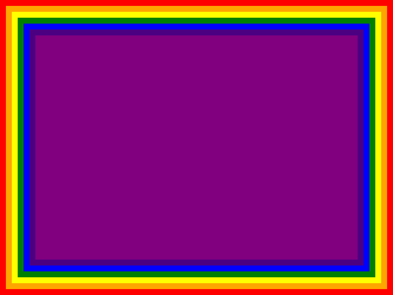

# toy_browser
Renderizador HTML e CSS básico feito com base no tutorial [Let's build a browser engine!
](https://limpet.net/mbrubeck/2014/08/08/toy-layout-engine-1.html) para aprendizado de Rust e HTML/CSS.

Funcionalidades:
- Parser de CSS e HTML
- Layout de blocos (`display: block`)
- Pintura

## Resultado
